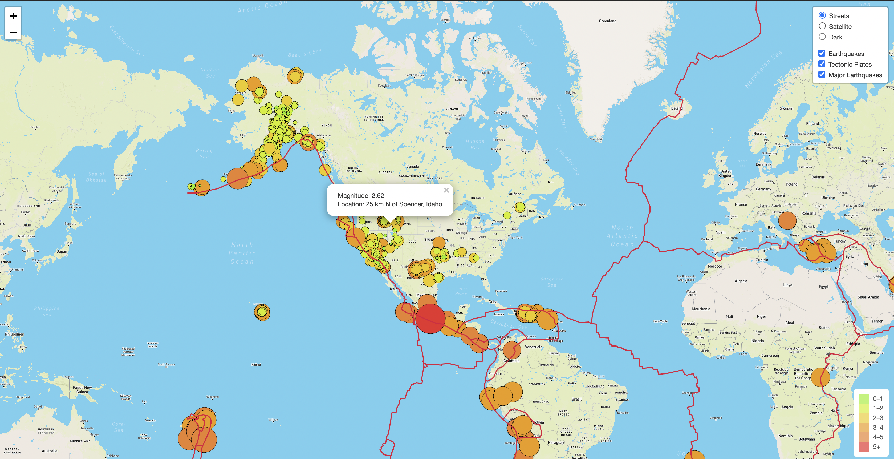

# Mapping Earthquakes

## Overview of the Challenge 

In this project, I built a visualization with interactive features on earthquakes from around the world. Using JavaScript, D3, and Leaflet I retrieved the latest earthquake data from the US Geological Survey website and plotted the data on a MapBox map through an API request.

On top of adding the latest earthquake data and adding major earthquakes as a layer to the map, I also added a layer to illustrate the relation between seismic activity and tectonic plates. 

**Figure 1: Illustration of the Map**

